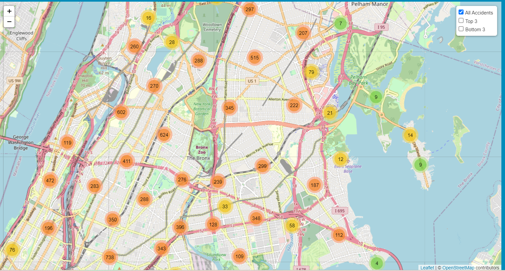
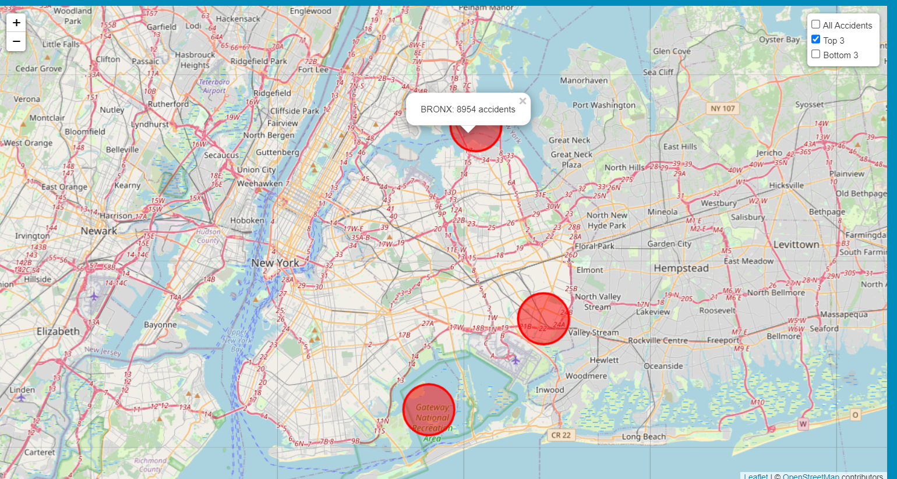
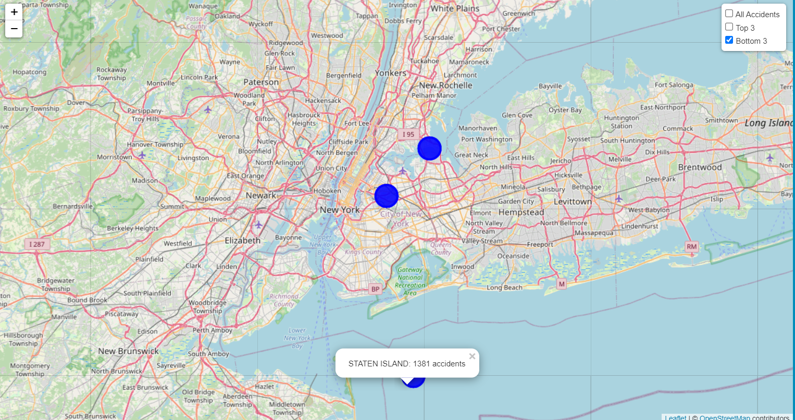
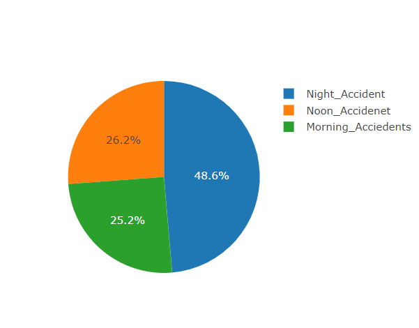
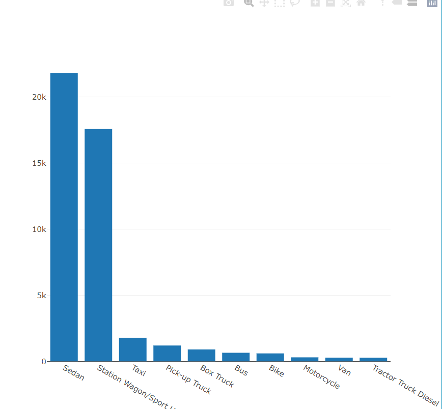

# Project_3

# Requirements
## Data and Delivery 
1. Data components used in the project are clearly documented.
2. The dataset contains at least 100 unique records.
3. A database is used to house the data (SQL, MongoDB, SQLite, etc.). (We use MongoDB).
4. The project is powered by a Python Flask API and includes HTML/CSS, JavaScript, and the chosen database.

## Back End
1. The page created to showcase data visualizations runs without error.
2. A JavaScript library not shown in class is used in the project.
3. The project conforms to one of the following designs: 
    1. A Leaflet or Plotly chart built from data gathered through web scraping.
    2. A dashboard page with multiple charts that all reference the same data.

## Visualization 
1. A minimum of three unique views present the data.
2. Multiple user-driven interactions (such as dropdowns, filters, or a zoom feature) are included on the final page.
3. The final page displays visualizations in a clear, digestable manner.
4. The data story is easy to interpret for users of all levels.

## Group Presentation
1. All group members speak during the presentation.
2. The content is relevant to the project.
3. The presentation maintains audience interest.
4. Content, transitions, and conclusions flow smoothly within any time restrictions.

# Analysis of Traffic Accidents In New York City

# Introduction

## General NYC Characteristics
1. New York city is home to 8.5 million people
2. In 2022, there were around 100,508 total traffic accidents in NYC
3. This breaks down to about roughly 625 accidents per day

## Reason for chossing NYC as a Model City
1. NYC is a very traffic accident prone city
2. It has vast data of accidents that can be analyzed
3. 38% of all traffic accidents in NYC end with fatality or injury

# Visualization

**1. Project Offers map with several layers, which gives out clustered data of all the accidents according to their Location.**
   

**2. Second Layer is for Top 3 cities where accidenets are most likely happen.**
  

**3. Third Layer is for Bottom 3 cities where accidenets are least likely happen.**
  

 **4. Pie Chart, which tries to capture the part of day when most accidents happen.**
   

**5. Bar Chart display the top 10 vehicle types that are prone to getting into the accidents.**
    

